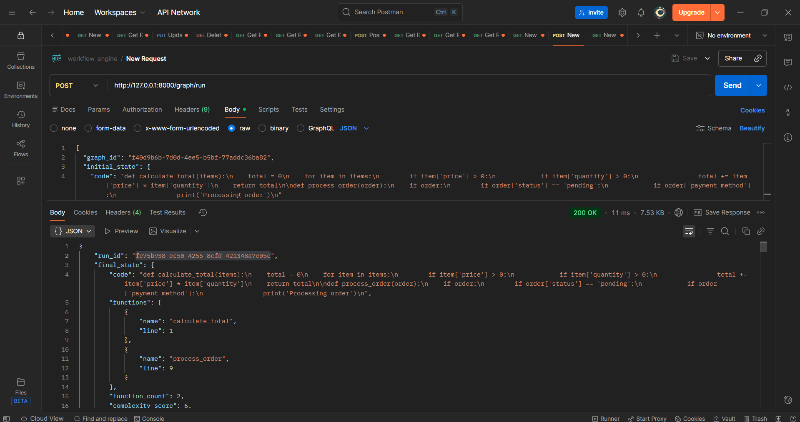
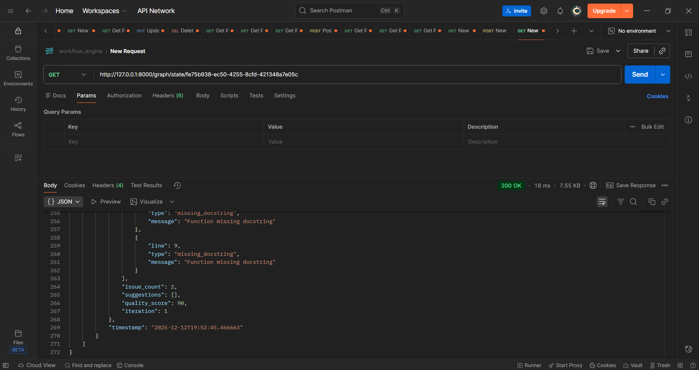

# Workflow Engine - AI Engineering Internship Assignment

A minimal workflow/graph execution engine built with FastAPI and Python. This system allows you to define sequences of steps (nodes), connect them with edges, maintain shared state, and execute workflows with support for branching and looping.

## 🚀 Quick Demo

This workflow engine implements a **Code Review Agent** that analyzes code quality through multiple steps and loops until the code meets quality standards.

### API Testing with Postman

Below are step-by-step screenshots showing how to test the API:

#### Step 1: GET Example Workflow
Get a pre-configured code review workflow with a unique `graph_id`.

**Endpoint:** `GET http://localhost:8000/graph/example`


**What you get:**
- `graph_id`: Use this to run the workflow
- `workflow_definition`: The complete workflow structure
- `example_initial_state`: Sample code to test with

---

#### Step 2: POST Run Workflow
Execute the workflow with your code and get quality analysis results.

**Endpoint:** `POST http://localhost:8000/graph/run`

**Request Body:**
```json
{
  "graph_id": "YOUR_GRAPH_ID_FROM_STEP_1",
  "initial_state": {
    "code": "def calculate_total(items):\n    total = 0\n    for item in items:\n        if item['price'] > 0:\n            if item['quantity'] > 0:\n                total += item['price'] * item['quantity']\n    return total"
  }
}
```



**What you get:**
- `run_id`: Unique identifier for this execution
- `final_state`: Complete analysis results (quality score, issues, suggestions)
- `execution_logs`: Step-by-step execution trace
- `status`: Execution status (completed/failed)

---

#### Step 3: GET Run State
Retrieve the detailed state and logs of a completed workflow run.

**Endpoint:** `GET http://localhost:8000/graph/state/{run_id}`

Replace `{run_id}` with the run_id from Step 2.



**What you get:**
- `current_state`: Final state with all analysis data
- `execution_logs`: Complete execution history
- `status`: Run status
- Full details of quality score, issues found, and suggestions

---

## 📋 Features

### Core Workflow Engine
- ✅ **Nodes**: Python functions that read and modify shared state
- ✅ **State Management**: Dictionary-based state that flows between nodes
- ✅ **Edges**: Define execution flow between nodes
- ✅ **Branching**: Conditional routing based on state values
- ✅ **Looping**: Repeat nodes until conditions are met
- ✅ **Execution Logging**: Track state changes at each step

### Example Workflow: Code Review Agent
The system includes a complete code review workflow:

1. **Extract Functions** - Identifies all functions in the code
2. **Check Complexity** - Measures code complexity (control flow statements)
3. **Detect Issues** - Finds problems like:
   - Long lines (>100 characters)
   - Missing docstrings
   - Code style violations
4. **Generate Suggestions** - Provides improvement recommendations
5. **Calculate Quality Score** - Assigns a score (0-100)
6. **Loop** - Repeats until quality score ≥ 70 or max 3 iterations

---

## 🛠️ Installation & Setup

### Prerequisites
- Python 3.8+ (3.11 or 3.12 recommended)
- pip package manager
- Postman (optional, for API testing)

### Step 1: Clone/Create Project
```bash
mkdir workflow-engine
cd workflow-engine
```

### Step 2: Create Virtual Environment
```bash
# Create virtual environment
python -m venv venv

# Activate it
# On Windows:
venv\Scripts\activate

# On Mac/Linux:
source venv/bin/activate
```

### Step 3: Install Dependencies
```bash
pip install -r requirements.txt
```

---

## ▶️ Running the Application

### Start the Server
```bash
python -m uvicorn app.main:app --reload --host 0.0.0.0 --port 8000
```

You should see:
```
INFO:     Uvicorn running on http://0.0.0.0:8000 (Press CTRL+C to quit)
INFO:     Started reloader process
INFO:     Application startup complete.
```

### Access Points
- **API Root:** http://localhost:8000
- **Interactive Docs (Swagger):** http://localhost:8000/docs
- **Alternative Docs (ReDoc):** http://localhost:8000/redoc

---

## 📁 Project Structure

```
workflow-engine/
├── app/
│   ├── __init__.py              # Package initialization
│   ├── main.py                  # FastAPI application & endpoints
│   ├── models.py                # Pydantic models for request/response
│   ├── graph_engine.py          # Core workflow execution engine
│   ├── tools.py                 # Tool registry & code review tools
│   └── workflows/
│       ├── __init__.py          # Workflows package
│       └── code_review.py       # Code review workflow definition
├── screenshots/                 # Postman API test screenshots
│   ├── postman-get-example.png
│   ├── postman-post-run.png
│   └── postman-get-state.png
├── requirements.txt             # Python dependencies
├── README.md                    # This file
└── test_workflow.py             # Optional test script
```

---

## 🔌 API Endpoints

### 1. Root Endpoint
**GET** `/`

Returns API information and available endpoints.

```json
{
  "message": "Workflow Engine API",
  "version": "1.0.0",
  "endpoints": {
    "POST /graph/create": "Create a new graph",
    "POST /graph/run": "Run a graph with initial state",
    "GET /graph/state/{run_id}": "Get the state of a run",
    "GET /graph/example": "Get example code review workflow"
  }
}
```

---

### 2. Create Graph
**POST** `/graph/create`

Create a custom workflow graph.

**Request Body:**
```json
{
  "name": "my_custom_workflow",
  "graph_definition": {
    "nodes": [
      {
        "name": "step1",
        "node_type": "simple",
        "tool_name": "extract_functions"
      }
    ],
    "edges": [
      {
        "from_node": "step1",
        "to_node": "step2"
      }
    ],
    "start_node": "step1",
    "end_nodes": ["end"]
  }
}
```

**Response:**
```json
{
  "graph_id": "123e4567-e89b-12d3-a456-426614174000",
  "message": "Graph 'my_custom_workflow' created successfully"
}
```

---

### 3. Get Example Workflow
**GET** `/graph/example`

Returns a pre-configured code review workflow.

**Response:**
```json
{
  "graph_id": "abc123...",
  "workflow_definition": { ... },
  "example_initial_state": {
    "code": "def calculate_total(items): ..."
  },
  "description": "A code review workflow..."
}
```

---

### 4. Run Graph
**POST** `/graph/run`

Execute a workflow with initial state.

**Request Body:**
```json
{
  "graph_id": "abc123...",
  "initial_state": {
    "code": "def hello():\n    print('world')"
  }
}
```

**Response:**
```json
{
  "run_id": "xyz789...",
  "final_state": {
    "code": "...",
    "quality_score": 85,
    "iteration": 2,
    "function_count": 1,
    "issue_count": 1,
    "complexity_level": "low",
    "suggestions": ["Add docstrings to functions"]
  },
  "execution_logs": [
    {
      "node_name": "extract",
      "state_before": { ... },
      "state_after": { ... },
      "timestamp": "2025-12-12T10:30:00"
    }
  ],
  "status": "completed"
}
```

---

### 5. Get Run State
**GET** `/graph/state/{run_id}`

Retrieve the state of a completed workflow run.

**Response:**
```json
{
  "run_id": "xyz789...",
  "current_state": { ... },
  "current_node": null,
  "status": "completed",
  "execution_logs": [ ... ]
}
```

---

### 6. List Tools
**GET** `/tools`

List all registered tools in the system.

**Response:**
```json
{
  "tools": [
    "extract_functions",
    "check_complexity",
    "detect_issues",
    "suggest_improvements",
    "calculate_quality_score"
  ]
}
```

---

## 🧪 Testing the API

### Option 1: Using Postman (Recommended)

1. **Import Collection** (or create requests manually):
   - GET `http://localhost:8000/graph/example`
   - POST `http://localhost:8000/graph/run`
   - GET `http://localhost:8000/graph/state/{run_id}`

2. **Follow the 3-step flow** shown in screenshots above

3. **Test with different code samples**

### Option 2: Using Swagger UI

1. Go to http://localhost:8000/docs
2. Click on any endpoint
3. Click "Try it out"
4. Fill in parameters
5. Click "Execute"

### Option 3: Using Python Script

Create `test_workflow.py`:

```python
import requests

BASE_URL = "http://localhost:8000"

# 1. Get example workflow
response = requests.get(f"{BASE_URL}/graph/example")
graph_id = response.json()["graph_id"]
print(f"Graph ID: {graph_id}")

# 2. Run workflow
test_code = """
def calculate(a, b):
    if a > 0:
        if b > 0:
            return a + b
    return 0
"""

run_response = requests.post(
    f"{BASE_URL}/graph/run",
    json={"graph_id": graph_id, "initial_state": {"code": test_code}}
)

result = run_response.json()
print(f"Quality Score: {result['final_state']['quality_score']}")
print(f"Suggestions: {result['final_state']['suggestions']}")
```

Run it:
```bash
python test_workflow.py
```

### Option 4: Using curl

```bash
# 1. Get example
curl http://localhost:8000/graph/example

# 2. Run workflow (replace GRAPH_ID)
curl -X POST http://localhost:8000/graph/run \
  -H "Content-Type: application/json" \
  -d '{
    "graph_id": "GRAPH_ID_HERE",
    "initial_state": {
      "code": "def hello():\n    print(\"world\")"
    }
  }'

# 3. Get state (replace RUN_ID)
curl http://localhost:8000/graph/state/RUN_ID_HERE
```

---

## 🏗️ Architecture

### Workflow Engine Components

1. **Graph Engine** (`graph_engine.py`)
   - Manages graph definitions and executions
   - Handles node traversal and state management
   - Implements loop and conditional logic

2. **Tool Registry** (`tools.py`)
   - Registers and manages executable tools
   - Provides code review analysis functions
   - Extensible for custom tools

3. **Models** (`models.py`)
   - Pydantic models for type safety
   - Request/response validation
   - Node types: SIMPLE, CONDITIONAL, LOOP

4. **API Layer** (`main.py`)
   - FastAPI endpoints
   - Request handling and validation
   - Error management

### Node Types

- **SIMPLE**: Sequential execution, moves to next node
- **CONDITIONAL**: Branches based on state conditions
- **LOOP**: Repeats until condition is met

### State Flow

```
Initial State → Node 1 → Node 2 → ... → Final State
                  ↓         ↓              ↓
                Tools    Tools          Tools
                  ↓         ↓              ↓
                State    State          State
```

---

## 🎯 What the Engine Supports

### ✅ Implemented Features

- **Sequential Execution**: Nodes execute in order
- **State Management**: Shared dictionary across all nodes
- **Conditional Branching**: Route based on state values
- **Loop Support**: Repeat nodes until conditions met
- **Execution Logging**: Complete audit trail
- **Tool Registry**: Pluggable function system
- **Safety Limits**: Max 100 iterations to prevent infinite loops
- **RESTful API**: Clean, documented endpoints
- **Type Safety**: Pydantic validation throughout

### 🔧 Code Review Tools

1. **extract_functions**: Finds all function definitions
2. **check_complexity**: Counts control flow statements
3. **detect_issues**: Identifies code problems
4. **suggest_improvements**: Generates recommendations
5. **calculate_quality_score**: Assigns 0-100 score

---

## 🚀 What Could Be Improved

### With More Time, I Would Add:

#### 1. **Async Execution**
- Support for `async/await` in tools
- Background task execution with Celery/Redis
- WebSocket streaming for real-time progress
- Concurrent node execution for parallel paths

#### 2. **Persistent Storage**
- SQLite/PostgreSQL database integration
- Save and resume workflow runs
- Query historical executions
- Graph versioning

#### 3. **Enhanced Conditionals**
- Python AST-based expression evaluation
- Complex boolean logic (AND/OR/NOT)
- Custom condition functions
- Safer evaluation without `eval()`

#### 4. **Parallel Execution**
- DAG-based dependency resolution
- Execute independent branches concurrently
- Resource pooling and rate limiting
- Distributed execution support

#### 5. **Better Error Handling**
- Retry mechanisms with exponential backoff
- Error recovery strategies
- Detailed error context in logs
- Graceful degradation

#### 6. **Monitoring & Observability**
- Prometheus metrics export
- OpenTelemetry tracing
- Structured logging with correlation IDs
- Performance profiling and optimization

#### 7. **Graph Visualization**
- Mermaid/GraphViz diagram generation
- Real-time execution visualization
- Interactive graph builder UI
- Execution replay and debugging

#### 8. **Advanced Features**
- **Subgraphs**: Composable workflow modules
- **Dynamic nodes**: Create nodes at runtime
- **State versioning**: Time-travel debugging
- **A/B testing**: Run multiple variants
- **Webhooks**: External system integration
- **Scheduled runs**: Cron-like scheduling

#### 9. **Security**
- API key authentication
- Rate limiting per user/IP
- Input sanitization
- RBAC (Role-Based Access Control)
- Audit logs

#### 10. **Testing & Quality**
- Comprehensive unit tests (pytest)
- Integration tests
- Load testing (Locust)
- CI/CD pipeline
- Code coverage >80%

#### 11. **Developer Experience**
- CLI tool for workflow management
- SDK for Python/JavaScript
- Workflow templates library
- Interactive tutorial
- Hot-reload for workflow definitions

#### 12. **Production Readiness**
- Docker containerization
- Kubernetes deployment manifests
- Health check endpoints
- Graceful shutdown
- Configuration management (env vars)
- Log rotation and archival

---

## 🏆 Design Decisions

### Why These Choices?

1. **In-memory storage**: 
   - ✅ Simplifies initial development
   - ✅ Easy to migrate to persistent storage
   - ✅ Fast for prototyping
   - ⚠️ Data lost on restart (acceptable for assignment)

2. **Synchronous execution**:
   - ✅ Easier to debug and reason about
   - ✅ Deterministic behavior
   - ✅ Can be made async with minimal changes
   - ⚠️ Blocks on long-running tasks

3. **Tool registry pattern**:
   - ✅ Decouples tools from engine
   - ✅ Easy to add new tools
   - ✅ Testable in isolation
   - ✅ Follows Open/Closed Principle

4. **Pydantic models**:
   - ✅ Type safety at runtime
   - ✅ Automatic validation
   - ✅ Great error messages
   - ✅ JSON Schema generation

5. **Simple condition evaluation**:
   - ✅ Uses Python's eval with restricted namespace
   - ✅ Flexible for simple cases
   - ⚠️ Should use AST parsing for production

6. **FastAPI framework**:
   - ✅ Modern, fast, and well-documented
   - ✅ Automatic API docs (Swagger/ReDoc)
   - ✅ Built-in validation
   - ✅ Easy to extend

---

## 📊 Example Output

### Code Analysis Results

```json
{
  "quality_score": 65,
  "iteration": 3,
  "function_count": 2,
  "issue_count": 5,
  "complexity_score": 12,
  "complexity_level": "high",
  "issues": [
    {
      "line": 15,
      "type": "long_line",
      "message": "Line exceeds 100 characters"
    },
    {
      "line": 3,
      "type": "missing_docstring",
      "message": "Function missing docstring"
    }
  ],
  "suggestions": [
    "Consider breaking down complex functions into smaller ones",
    "Address code style issues for better readability"
  ]
}
```

---

## 📝 Notes for Reviewers

### What I Focused On

1. **Clean Architecture**: Separation of concerns, modular design
2. **Type Safety**: Pydantic models throughout
3. **Extensibility**: Easy to add new tools and workflows
4. **Documentation**: Comprehensive README, code comments, API docs
5. **Error Handling**: Proper exceptions and HTTP status codes
6. **State Management**: Clear state flow and logging

### Trade-offs Made

- **In-memory storage** instead of database (faster development)
- **Simple eval** for conditions instead of AST (easier to implement)
- **Synchronous** execution instead of async (simpler logic)
- **Basic tools** instead of ML models (assignment requirement)

These choices prioritize clarity and correctness over production features, as requested in the assignment.

---

## 🤝 Contributing

This is an assignment submission, but the code is structured to be extended:

1. Add new tools in `app/tools.py`
2. Create new workflows in `app/workflows/`
3. Extend the engine in `app/graph_engine.py`
4. Add endpoints in `app/main.py`

---

## 📄 License

This is an assignment submission for the AI Engineering Internship.

---

## 📧 Contact

For questions about this implementation, please refer to the assignment submission details.

---

## 🎓 Assignment Requirements Checklist

- ✅ Minimal workflow/graph engine
- ✅ Nodes as Python functions
- ✅ State management (dictionary)
- ✅ Edges for flow control
- ✅ Branching support (conditional)
- ✅ Looping support
- ✅ Tool registry
- ✅ FastAPI endpoints
  - ✅ POST /graph/create
  - ✅ POST /graph/run
  - ✅ GET /graph/state/{run_id}
- ✅ Example workflow (Code Review)
- ✅ Clean code structure
- ✅ Comprehensive README
- ✅ Easy to run and test

---

**Built with ❤️ for AI Engineering Internship Assignment**
